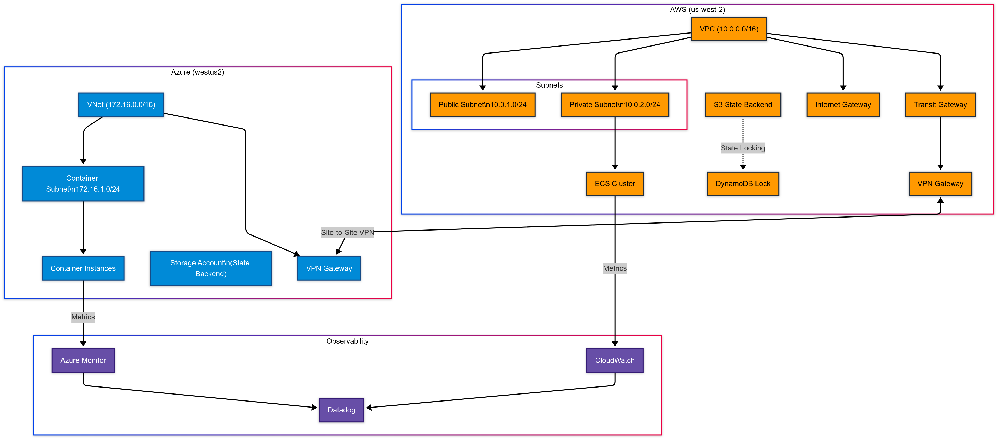

# Infrastructure Changes Overview

## Summary of Approach

Applied Terraform best practices by implementing a modular design with shared base modules,
removing duplication between cloud providers, and maintaining provider-specific implementations
where necessary. This approach improves maintainability and ensures consistent resource configuration
across cloud providers.

## High Level System Design Arch



## Module Structure
```
modules/
├── base/
│   ├── container/
│   │   ├── variables.tf
│   │   └── outputs.tf
│   ├── monitoring/
│   │   ├── variables.tf
│   │   └── outputs.tf
│   ├── networking/
│   │   ├── variables.tf
│   │   └── outputs.tf
│   └── tags/
│       ├── variables.tf
│       └── outputs.tf
├── aws/
│   ├── container/
│   └── networking/
└── azure/
    ├── container/
    └── networking/
```

## Base Modules Overview

### Tags Module
- Centralized tag management
- Provider-specific validation
- Standard tag enforcement
- Automatic timestamp management

### Monitoring Module
- Cross-cloud metrics configuration
- Standardized alert definitions
- Log retention policies
- Common monitoring interfaces

### Networking Module
- Shared networking variables
- Cross-cloud connectivity definitions
- Common subnet structures
- Network tier validation

### Container Module
- Standard container definitions
- Resource allocation templates
- Common deployment patterns
- Service configuration baseline

## AWS Modules Design Decisions and changes

### Networking Module
- Route table configuration
  - Dynamic Internet Gateway setup
  - Configurable public/private routing
  - Transit Gateway integration
- Variable-based CIDR blocks
- Standardized resource tagging

### Container Module (ECS)
- Configurable resource allocation:
  - CPU/Memory settings
  - Network mode options
  - Launch type selection
- Enhanced container support:
  - Multi-container tasks
  - Dynamic port mapping
  - Resource allocation controls
- Service improvements:
  - Configurable desired count
  - Multi-subnet support
  - Public IP assignment toggle

## Azure Modules Design Decisions and changes

### Container Module
- Resource Management:
  - CPU/Memory controls
  - Environment variable support
  - Network profile integration
- Security Enhancements:
  - Private IP by default
  - Health monitoring
  - Diagnostic settings
- Monitoring Integration:
  - Log Analytics
  - Health probes
  - Diagnostic outputs

### Networking Module
- Resource Organization:
  - Dedicated resource groups
  - Consistent naming scheme
  - Lifecycle management
- Security Controls:
  - prevent_destroy where needed
  - Proper RBAC integration
  - Resource validation

## Resource Tagging Standards

### Required Tags
All resources must include these tags:
- `Environment` - (dev/staging/prod)
- `CostCenter` - Department/Project code
- `Owner` - Team responsible
- `ManagedBy` - "terraform"
- `LastModified` - Timestamp of last change

### Module-specific Tags
- Networking resources: Include `NetworkTier`
- Container resources: Include `ApplicationName` and `ServiceTier`

### Tag Validation
- AWS tags must match pattern: ^[a-zA-Z0-9+\-=._:/@]+$
- Azure tags must match pattern: ^[a-zA-Z0-9+\-=._:/@]+$
- Tag validation is enforced through the base tags module
- Cloud provider-specific validation through regex patterns

### Base Modules Design

#### Tags Module
- Centralized tag management
- Cloud provider-specific validation
- Required tags enforcement:
  - Environment
  - CostCenter
  - Owner
  - ManagedBy
  - LastModified
- Supports additional custom tags
- Provider-specific tag format validation

## Deployment Methods 

### Manual Deployment
```bash
terraform init      # Initialize providers and modules
terraform plan     # Review changes
terraform apply    # Apply infrastructure changes
```

### GitHub Actions Setup
Required secrets:
- AWS_ROLE_ARN
- AZURE_CREDENTIALS
- TF_STATE_STORAGE

Environment configuration:
- shared-services
- production

## GitHub Actions Workflows

### Pull Request (PR) Workflow
Automatically runs when PRs are opened/updated against main branch:
- Terraform format checking
- TFLint static analysis
- Configuration validation
- Security scanning with Checkov
- Infrastructure plan generation
- Posts results as PR comment

### Release Workflow
Triggers on new release publication:
1. Validation Stage:
   - Configuration validation
   - Security scanning
2. Shared Services Stage:
   - Deploys network infrastructure
   - Requires environment approval
3. Production Stage:
   - Deploys AWS/Azure resources
   - Creates deployment summary
   - Generates documentation

Required Secrets:
- AWS_ROLE_ARN: AWS IAM role for deployments
- AZURE_CREDENTIALS: Azure service principal
- AWS_ACCESS_KEY_ID/AWS_SECRET_ACCESS_KEY: AWS credentials
- AZURE_CLIENT_ID/SECRET/SUBSCRIPTION_ID/TENANT_ID: Azure auth

## State Management

### Local State (Default)
By default, Terraform will store state locally. This is suitable for testing and development.

### AWS S3 Backend (Optional)
To use AWS S3 for state storage:

1. Create an S3 bucket and DynamoDB table:
```bash
# Create S3 bucket
aws s3api create-bucket \
    --bucket your-terraform-state-bucket \
    --region us-west-2 \
    --create-bucket-configuration LocationConstraint=us-west-2

# Enable versioning
aws s3api put-bucket-versioning \
    --bucket your-terraform-state-bucket \
    --versioning-configuration Status=Enabled

# Create DynamoDB table for state locking
aws dynamodb create-table \
    --table-name terraform-state-lock \
    --attribute-definitions AttributeName=LockID,AttributeType=S \
    --key-schema AttributeName=LockID,KeyType=HASH \
    --billing-mode PAY_PER_REQUEST
```

2. Create a backend configuration file (backend.tf):
```hcl
terraform {
  backend "s3" {
    bucket         = "your-terraform-state-bucket"
    key            = "terraform.tfstate"
    region         = "us-west-2"
    encrypt        = true
    use_lockfile   = true
  }
}
```

### Azure Storage Backend (Optional)
To use Azure Storage for state storage:

1. Create Azure Storage Account and Container:
```bash
# Create Resource Group
az group create --name terraform-state-rg --location eastus

# Create Storage Account
az storage account create \
    --name yourterraformstate \
    --resource-group terraform-state-rg \
    --location eastus \
    --sku Standard_LRS

# Create Container
az storage container create \
    --name tfstate \
    --account-name yourterraformstate
```

2. Create a backend configuration file (backend.tf):
```hcl
terraform {
  backend "azurerm" {
    resource_group_name  = "terraform-state-rg"
    storage_account_name = "yourterraformstate"
    container_name       = "tfstate"
    key                 = "terraform.tfstate"
  }
}
```

### Authentication
- For AWS: Configure credentials using environment variables or AWS CLI (`aws configure`)
- For Azure: Log in using Azure CLI (`az login`)

## Environment Configuration

### Environment Variable Rules
```hcl
environment = "dev|staging|prod|shared"  # Required deployment environment
cost_center = string                     # Required cost center code
owner       = string                     # Required resource owner
```

### Validation Rules
- Environment must be one of: dev, staging, prod, shared
- Cost center must not be empty
- Owner must not be empty
- Container registry must match pattern: ^[a-zA-Z0-9][a-zA-Z0-9-_./]*$
- Network tier must be one of: public, private, data
- Service tier must be one of: frontend, backend, data

### Default Values
```hcl
environment = "prod"
cost_center = "devops-infrastructure"
owner       = "platform-team"
```

## Cross-Cloud Networking

### AWS Configuration
- VPC CIDR: 10.0.0.0/16 (shared), 10.1.0.0/16 (prod)
- Public Subnet: 10.x.1.0/24
- Private Subnet: 10.x.2.0/24
- Transit Gateway ASN: 64512

### Azure Configuration
- VNET Address Space: 172.16.0.0/16
- Container Subnet: 172.16.1.0/24
- Transit Subnet: 172.16.2.0/24
- VPN Client Pool: 172.17.0.0/24

### Connectivity
- Site-to-Site VPN between AWS Transit Gateway and Azure VPN Gateway
- Private connectivity for container workloads
- Shared services VPC acts as transit hub

## Container Services

### AWS ECS Configuration
- Launch Type: FARGATE
- Network Mode: awsvpc
- Default CPU: 256 (.25 vCPU)
- Default Memory: 512 MiB

### Azure Container Instances
- Default CPU: 0.5 cores
- Default Memory: 1.0 GB
- Network Type: Private
- Health Monitoring: 
  - Liveness Probe: /health
  - Readiness Probe: /ready

## Recent Infrastructure Improvements

### Security Enhancements
- Added TLS 1.2 enforcement for Azure Storage accounts
- Implemented IP-based access restrictions for state storage
- Added security group configurations for AWS networking
- Enhanced encryption for S3 state storage
- Added state storage access logging

### State Management
- Implemented Terragrunt for better state management
- Added state bucket logging and monitoring
- Prevented accidental state storage deletion
- Added workspace-based state organization
- Improved state locking mechanisms

### Infrastructure Resilience
- Added container health monitoring
  - Readiness probes for Azure containers
  - Health check endpoints
  - Monitoring integration
- Implemented lifecycle management
  - Create before destroy for security groups
  - Prevent destroy for critical components
  - Resource dependency management

### Resource Organization
- Fixed resource group references
- Improved resource naming consistency
- Enhanced tag management
- Added environment validation
- Standardized container registry validation

### Variable Management
- Added input validation for all critical variables
- Implemented environment-specific configurations
- Enhanced cost center tracking
- Added owner validation

## Updated Deployment Methods 

### Terragrunt Usage
```hcl
# Initialize and plan with Terragrunt
terragrunt init
terragrunt plan

# Apply changes using workspace
terragrunt apply
```

### Environment Variables
Required environment variables for deployment:
```bash
export TF_VAR_environment="prod"
export TF_VAR_cost_center="your-cost-center"
export TF_VAR_owner="your-team"
```

## Testing Infrastructure

### Terratest Implementation
Tests are located in the `/test` directory and validate:
- VPC/VNET creation and configuration
- Subnet allocation and routing
- Container service deployment
- Cross-cloud connectivity
- Resource tagging compliance

### Terratest Configuration
- Located in `/test` directory
- Requires Go 1.20+
- Uses Terratest modules for AWS and Azure
- Supports parallel test execution
- Automated cleanup after tests

### Test Prerequisites
- Valid AWS credentials with required permissions
- Valid Azure service principal
- Go environment configured
- Required environment variables set
- Terraform binary in PATH

For detailed setup instructions and examples, see [Test README](./test/README.md)

### Running Tests Locally
```bash
cd test
go test -v ./...
```

### CI/CD Integration
- Tests run automatically on pull requests
- Validates infrastructure changes
- Ensures tag compliance
- Verifies cross-cloud connectivity
- Results posted as PR comments

## Future Improvements

### Infrastructure Enhancements
- Implement consistent resource naming strategy using `{prefix}-{environment}-{resource-type}-{instance}`
- Add multi-region support with region-specific CIDR mappings
- Enhance security with KMS encryption for sensitive resources
- Implement comprehensive network security controls

### Monitoring & Observability
- Add Datadog Monitoring & Observability
- Implement container health checks
- Set up metric alerting for resource utilization
- Configure log retention policies

### Security

- Enable Guardduty
- Send CloudTrail & Guarduty logs to Datadog SIEM 


### Cost Management
- Implement mandatory cost allocation tags
- Set up budget monitoring and alerts
- Configure cost center tracking
- Add billing ID tags for charge-back

### Disaster Recovery
- Implement automated backup plans
- Configure recovery services vaults
- Set up cross-region replication where needed
- Define backup retention policies

### CI/CD Improvements
- Add workspace validation in CI pipeline
- Implement pre-commit hooks
- Enhance pipeline security checks
- Add drift detection
